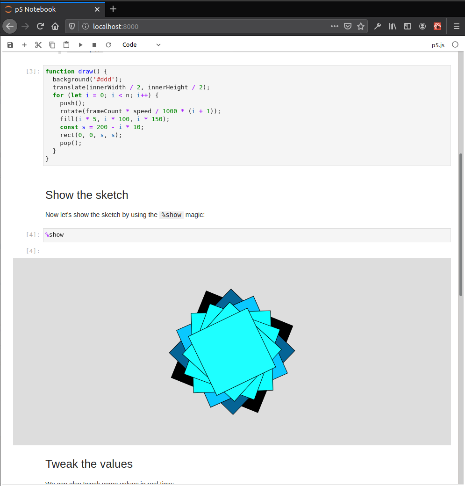

#  p5-notebook 

[](https://github.com/jtpio/p5-notebook/actions)

A minimal Jupyter Notebook UI for [p5.js](https://p5js.org) kernels.

**✨ [Try it in your browser!](https://p5-notebook.now.sh/) ✨**



## Status

This is still an experiment 🧪.

Feel free to open an issue if you have any feedback, and PRs are also welcome! Thanks!

## Dev install

Make sure [Node.js](https://nodejs.org) is installed.

```bash
yarn
yarn run build
npx http-server
```

Open http://localhost:8080 in your browser.

There is also a `watch` command to automatically rebuild the application when there are new changes:

```bash
yarn run watch
```

## How it works

This notebook interface is built using components from the [JupyterLab computational environment](https://github.com/jupyterlab/jupyterlab).

JupyterLab is the next-gen UI for [Project Jupyter](https://jupyter.org), and is itself built as a set of extensions. These extensions are modular and can be reused in alternative frontends such as this notebook interface.

Jupyter front-ends usually rely on a server known as the Jupyter Server (also called the Notebook Server). This server is written in Python and handles request coming from the client, such as starting a new kernel or retrieving the content of a Jupyter notebook. The kernels usually run on the host machine, but it is also possible to have kernels running on a remote machine.

Because the p5 notebook runs entirely in the browser, it relies on a very minimal Jupyter Server that also runs in the browser and exposes (parts of) the [notebook server REST API](http://petstore.swagger.io/?url=https://raw.githubusercontent.com/jupyter/notebook/master/notebook/services/api/api.yaml). This makes it easier to reuse components from core JupyterLab and swap the backend to an alternative one running in the browser.

p5.js kernels also run in the browser in their own IFrame. The IFrame provides the execution engine for the kernel and this is where its state is kept.

## Related projects

- nb5.js, a notebook for p5js sketches (proof of concept): https://github.com/aparrish/nb5js-proof-of-concept
- p5.js Jupyter Widget: https://github.com/jtpio/ipyp5
- [archived / demo] p5.js in the Classic Jupyter Notebook with Jupyter Widgets: https://github.com/jtpio/p5-jupyter-notebook
- Jupyter Kernels, right inside JupyterLab: https://github.com/deathbeds/jyve
- JupyterLite has:

  > - Python kernel backed by Pyodide running in a Web Worker
  >   - Initial support for interactive visualization libraries such as altair, bqplot, ipywidgets, matplotlib, and plotly
  > - JavaScript and P5.js kernels running in an IFrame

  https://github.com/jupyterlite/jupyterlite
